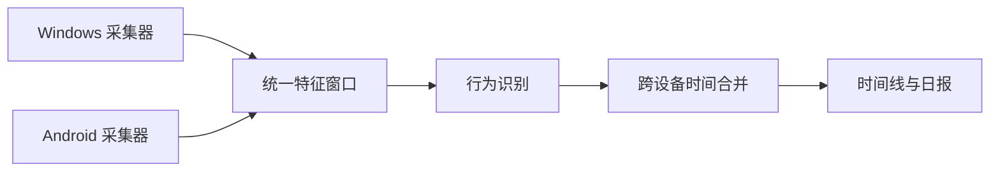

# 行迹（Activity Timeline）实施计划

> 本文把 `ineed.md` 中的探索性设想，与当前仓库已经实现的能力对齐。目标不是一次性把所有想法做完，而是先建立一个可信的单设备行为识别闭环，再逐步扩展到跨设备合并、日报和个性化分类。

## 1. 先说结论

你的目标已经表达得比较清楚：这不是一个“统计软件打开时长”的网页，而是一个**跨设备自动行为日记**：



目前还没有完全定下来的，是三个产品定义：

1. “主要活动”如何在电脑和手机重叠时确定。
2. “行为”和“目的”如何分层，例如“阅读 CUDA 文档”是行为，“学习”是目的。
3. “无设备记录”究竟表示设备离线、电脑息屏，还是用户主动离开设备。

因此目前最合理的路线不是直接接入 LLM，而是先把事件语义和时间计算规则做稳定。

## 2. 当前实现到什么程度

### 已经落地

| 能力 | 当前状态 | 与目标的差距 |
|---|---|---|
| Windows 前台窗口采集 | 已实现。约 10 秒生成一个特征窗口，记录进程、窗口标题、键鼠计数、空闲时长 | 尚未采集浏览器域名、媒体播放状态、控件类型 |
| Windows 隐私边界 | 已实现。不保存键盘内容，剪贴板只保存类型和长度档位 | 还需要完善脱敏标题、排除名单和数据删除 |
| Windows 离线可靠性 | 已实现。本地队列、失败重传、序列号去重、工作线程、单实例 | 尚缺少明确的采集器在线心跳和运行状态模型 |
| Android 采集器 | 已有可构建的 Java 应用。使用 UsageStats/系统事件、锁屏区间、本地队列和 WorkManager 上传 | 需要真机持续运行验证、权限引导和后台限制适配 |
| 统一事件模型 | 已实现 `FeatureWindow`，包含平台、设备、时间、应用/窗口和交互特征 | 缺少域名、主题、媒体状态、置信度、采集质量等字段 |
| SQLite 存储 | 已实现原始特征窗口、活动片段、设备信息和人工修正 | 尚未分离原始数据、派生数据和用户确认数据的生命周期 |
| 规则分类 | 已实现 YAML 规则，支持 Windows/Android、进程和标题匹配 | 当前主要输出“学习/工作/娱乐/空闲/其他”，没有独立的行为层和目的层 |
| 活动片段合并 | 已实现相同活动合并、短暂切换吸收、人工分类修正 | 仍是单设备内合并，不是跨设备主活动合并 |
| 无设备时间 | 已实现。基于原始采集窗口覆盖范围，只把连续缺失达到 5 分钟的区间标记出来 | 还不能区分电脑息屏、采集器停止、设备断网和主动离开 |
| 时间线与统计 | 已实现时间线、分类环形图、三行八小时按时间视图、设备筛选 | 缺少应用排行、最长专注时长、切换消耗、日报摘要 |
| 浏览器访问与认证 | 已实现 Token、Cookie/Bearer、局域网手机页、当前状态接口 | 公网部署、密钥轮换、设备级认证和审计还未完成 |
| 测试 | 后端测试、数据库迁移测试、Android 工程测试、采集器架构测试已存在 | 缺少真实 Windows/Android 联调和跨设备时间合并测试 |

### 当前最重要的判断

当前系统已经是一个**Windows + Android 特征窗口 Demo/Alpha**，不是最终的跨设备行为日记。现在的后端流程基本是：

```text
FeatureWindow
  -> 按 device_id 分类
  -> 各设备独立生成 activity_segments
  -> 网页并列显示、筛选和汇总
```

而目标产品需要的是：

```text
多设备 FeatureWindow
  -> 统一时间轴
  -> 计算重叠和主要活动
  -> 生成行为层 + 目的层
  -> 输出带证据和置信度的日记片段
```

## 3. 建议的产品定义

### 3.1 两层语义，不要把所有概念塞进 category

建议把结果拆成四个字段：

- `behavior`：正在做什么，例如编程、阅读、写作、沟通、观看视频、浏览、空闲。
- `purpose`：这件事服务于什么目的，例如学习、工作、娱乐、生活事务。
- `topic`：主题或项目，例如 Mini-NCCL、CUDA、招聘、某个工作项目。
- `confidence`：规则或模型对结果的信心，以及可解释原因。

现有 `category` 可以暂时作为 `purpose` 的兼容字段，等新模型稳定后再迁移 API。

### 3.2 时间语义

区分三种情况：

1. **有设备窗口但没有输入**：仍然有窗口、应用或媒体状态，优先判断为空闲、阅读或观看视频，不叫无设备。
2. **设备有明确锁屏/息屏事件**：记录为设备空闲或锁屏，保留设备来源。
3. **所有选定设备都没有原始窗口上报**：才叫“无设备记录”，并附带原因未知，不直接断言用户在运动或睡觉。

“无设备记录”应该是一个观测结果，不应该直接等价于“运动/睡觉”。界面可以显示“可能在运动、睡觉或进行不需要设备的活动”，但不要把它当成确定分类。

## 4. 分阶段路线

### Phase 0：冻结数据和产品边界

**目标：** 让后续开发不会因为字段含义反复变化而返工。

任务：

- 确定时间粒度：原始窗口 10 秒，行为识别窗口先采用 30 秒或 60 秒聚合。
- 确定时区、夏令时、迟到事件和跨午夜规则。
- 确定 `behavior`、`purpose`、`topic`、`confidence` 的字段定义。
- 明确“无设备记录”只表达观测缺失，不自动声明运动或睡觉。
- 确定默认设备集合：全部设备、单设备、主设备三种视图。
- 建立隐私清单：哪些字段永不上传，哪些字段可本地保存，哪些字段允许用户删除。

**验收标准：** 写出一份事件 JSON 示例和 8 个边界案例：电脑空闲、电脑息屏、手机锁屏、两设备重叠、设备断网、跨午夜、短暂采样丢失、完全没有设备。

### Phase 1：稳定 Windows 单设备闭环

**目标：** 先让“电脑采集 -> 分类 -> 时间线 -> 人工纠正”可靠，作为所有后续比较的基准。

任务：

- 保留当前特征窗口和离线队列设计。
- 增加浏览器域名采集，优先使用浏览器扩展；没有扩展时不猜测域名。
- 增加采集质量字段：窗口是否连续、最后上报时间、采集器版本、丢失窗口数。
- 把空闲判断拆为：键鼠空闲、屏幕锁定/息屏、媒体播放中。
- 扩充规则：IDE、终端、技术文档、GitHub、视频站、聊天、招聘和游戏。
- 保留“规则命中原因”，在详情页展示“为什么归类为学习/工作”。
- 补齐真实 Windows 采集器烟雾测试和时间边界测试。

**验收标准：** 连续运行一天后，时间线无重复、无负时长；观看视频不因没有键鼠输入被切成空闲；浏览技术视频和娱乐视频能够通过规则区分；任何键盘原文和剪贴板原文都不会出现在数据库、日志或请求中。

### Phase 2：统一 Android 采集和设备状态

**目标：** 让 Android 采集器成为可靠的数据源，而不只是一个可构建项目。

任务：

- 真机验证 Usage Access 权限、锁屏事件、应用切换和后台限制。
- 明确 Android 的采集窗口边界，避免 WorkManager 的 15 分钟运行周期被误解为 15 分钟采样周期。
- 增加设备心跳、最后成功采集时间、最后成功上传时间。
- 应用包名映射到稳定的应用名称和规则类别。
- 断网时验证本地队列上限、重传、重复上传和时钟漂移。
- 设计设备撤销、Token 更新和本地数据清理入口。

**验收标准：** Android 真机连续运行 24 小时；断网后恢复不会丢失或重复片段；手机锁屏与“没有任何设备记录”在 API 中可区分。

### Phase 3：真正的跨设备时间合并

**目标：** 解决文档中最有价值、也是当前尚未完成的核心问题：电脑和手机同时活动时不能简单相加。

建议先实现确定性的优先级模型，不立即使用模型：

```text
同一时间段内：
1. 明确前台且有持续交互的设备活动
2. 明确媒体播放中的活动
3. 有前台但长时间无交互的活动
4. 锁屏/息屏
5. 无任何设备窗口
```

任务：

- 将各设备片段切分到统一时间轴，计算重叠区间。
- 为每个区间计算 `engagement_score`，使用键鼠频率、滚动、应用类型、前台持续时间、媒体状态和最近切换。
- 输出一个“主活动”，同时保留次要活动和被折叠的重叠活动。
- 不删除原始设备片段；主活动只是派生结果。
- 对“电脑看课程 + 手机刷视频”显示主活动、次要活动和重叠时长，而不是把时间加倍。
- 将跨设备合并结果单独存表，例如 `combined_segments`，不要直接覆盖设备原始片段。

**验收标准：** 给定固定的电脑/手机事件样例，合并结果可重复；全天各主活动时长之和不超过当天有效时间；重叠时长、主次活动和选择理由都可查询。

### Phase 4：行为层、目的层和可解释分类

**目标：** 从“软件名称”升级到“你正在做什么，以及为什么做”。

任务：

- 先建立行为枚举：编程、阅读、写作、搜索、沟通、观看视频、浏览、空闲、系统等待。
- 再建立目的枚举：学习、工作、娱乐、生活事务、未知。
- 规则优先，使用标题、域名、项目名、应用类型和交互模式。
- 每个分类保存证据：命中的规则、使用的字段、被排除的冲突规则。
- 允许人工修正行为和目的，而不仅是修改 category。
- 统计规则命中率、人工修正率和不确定片段比例。

**验收标准：** 同一个“阅读”行为可以根据域名、标题和个人规则分别归入学习、工作或娱乐；页面能说明分类依据；用户修正能在重建片段后保留。

### Phase 5：日报和真正有用的结果

**目标：** 完成 `ineed.md` 中提到的四个核心结果。

先做：

1. 当日时间线。
2. 学习/工作/娱乐/生活事务占比。
3. 应用、域名和行为排行。
4. 最长连续专注时间。

再做：

- 高频切换次数和切换成本。
- 无意识刷手机候选区间。
- 计划时间与实际时间对比。
- 当日摘要：“主要完成了什么、被什么打断、哪些结论置信度较低”。
- 日/周/月趋势，而不是只做今天。
- 导出 JSON/CSV，按日期删除原始数据。

**验收标准：** 用户只看日报就能回答：今天时间花在哪里、哪些时间重叠、最长专注多久、哪些记录需要人工确认。

### Phase 6：个性化和可选智能辅助

**目标：** 在规则和人工反馈积累后，才引入模型。

任务：

- 先用人工修正记录构造个人规则和小型分类数据集。
- 统计哪些模式规则无法判断，再决定是否调用本地模型或远程 LLM。
- 只发送脱敏后的域名、应用类别和标题摘要；默认不发送原始文本。
- LLM 结果必须带置信度、解释和可撤销状态，不能静默覆盖规则。
- 支持“始终按我的规则处理该应用/域名”。

**验收标准：** LLM 关闭时核心功能仍完整；模型不可用时自动回退到规则；任何模型分类都能追溯输入字段和结果。

## 5. 建议的数据模型演进

当前 `feature_windows` 和 `activity_segments` 可以继续保留，建议逐步增加以下派生层：

```text
feature_windows       原始脱敏特征，按设备写入，不覆盖
activity_segments     单设备行为片段，可人工修正
combined_segments     跨设备主活动片段，不覆盖原始片段
classification_evidence 规则/模型依据、置信度和版本
user_corrections      用户反馈和修正历史
collector_heartbeats  设备在线、采集质量和版本
```

建议不要立刻删除或重命名当前 `category` 字段：先把它作为兼容字段，新增 `behavior`、`purpose` 和 `confidence`，前端逐步迁移。

## 6. 近期优先级

下一轮最值得做的不是大改 UI，也不是接 LLM，而是：

1. 建立跨设备重叠合并的纯 Python 规则模块和固定样例测试。
2. 为 Windows/Android 增加心跳和采集质量信息，重新定义“无设备记录”。
3. 把 `behavior` 与 `purpose` 从当前单一 `category` 中拆出来。
4. 增加应用/域名排行和最长连续专注时间。
5. 在真实 Windows + Android 连续运行 24 小时后，再决定哪些地方值得使用模型。

## 7. 暂不做的事情

- 不保存原始键盘输入、聊天正文、剪贴板原文或默认连续截图。
- 不一开始支持 iPhone 后台全量行为采集。
- 不用 LLM 替代基础规则和时间合并。
- 不把“无设备记录”直接断言成运动或睡觉。
- 不把多个设备的重叠时长直接相加。
- 不在还没有真实数据质量指标时追求复杂的个性化模型。

## 8. 探索阶段需要你确认的决策

这些问题会影响后续数据模型，建议在进入 Phase 3 前决定：

1. 你要统计的是“设备使用时间”，还是“人的主要活动时间”？两者需要同时保留，但日报主指标只能选一个。
2. 电脑播放课程、手机刷视频时，哪一个默认作为主活动？是否允许按应用或时间段设置优先级？
3. “无设备记录”是否只作为事实状态，还是允许用户手动标记为运动、睡觉、外出？
4. 你最关心的目的分类是学习/工作/娱乐，还是还需要生活事务、通勤和睡眠？
5. 结果页的核心入口是今天时间线、日报摘要，还是长期趋势？
6. 数据是否永远只保存在本地，还是允许你通过公网访问自己的实例？如果公网访问，是否需要设备级 Token 而不仅是共享 Token？

## 9. Definition of Done

当以下条件全部满足时，可以认为第一版产品真正完成：

- Windows 和 Android 都能连续采集并离线恢复。
- 原始数据不包含键盘内容、剪贴板原文和默认截图。
- 单设备片段稳定，短切换、空闲、锁屏和采集缺失语义可区分。
- 跨设备重叠不会导致日报时长翻倍。
- 每个行为结果都有目的、证据和置信度。
- 用户可以修正、删除和导出数据。
- 页面能展示时间线、占比、排行、最长专注和切换消耗。
- 关键边界案例有自动化测试，真实设备至少完成一次 24 小时联调。
